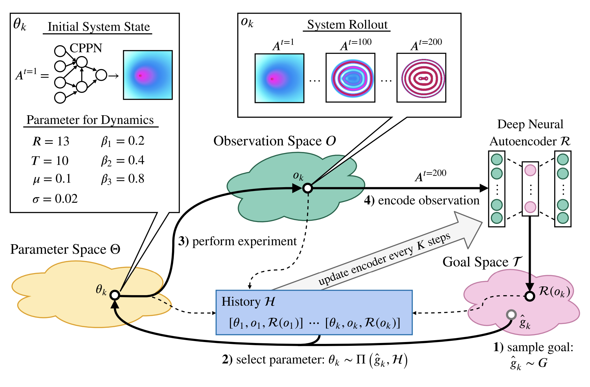

# Automated Discovery Tool
We're pleased to introduce Automated Discovery Tool, a software for assisted 
and automated discovery of patterns in the exploration of complex systems.

Automated Discovery Tool is a software package developed in the 
[Inria FLOWERS](https://flowers.inria.fr) research team which provides an 
integrated solution for studying complex systems through curiosity-search 
methods, consisting of a user-friendly Web UI and an extensible Python library 
for user-defined experimentation systems and search algorithms. 

In the above demo, the tool is used to discover life-like propagating patterns
in a cellular automata simulation, showcasing how a researcher can specify
a series of experiments and monitor their results through both the Web UI and 
an integrated Jupyter notebook.

The software was designed and maintained with contributions from Chris Reinke, 
Clément Romac, Matthieu Perie, Mayalen Etcheverry, Jesse Lin, 
and other collaborators in the FLOWERS team.
## Summary
### Scientific Background: Curiosity Search
The high-dimensional phase space of a complex system poses many challenges to
study. In particular, it is often desirable to explore the behavior space of
such systems for interesting behaviors without knowing a priori the precise
quantities to look for. As such, a class of algorithms based on intrinsic
motivation or "curiosity" has been proposed in 
[Reinke et al., 2020](https://arxiv.org/abs/1908.06663) and extended in
e.g., [Etcheverry et al., 2020](https://arxiv.org/abs/2007.01195)

Such curiosity algorithms enable a system to automatically generate a
learning curriculum from which it learns to explore its behavior space
autonomously in search of interesting behaviors, originally proposed in the
context of robotic agents learning to interact with their environment
in an unsupervised manner, as in 
[Oudeyer et al., 2007](https://ieeexplore.ieee.org/document/4141061).

In practice, dealing with such ill-posed and/or subjective search tasks requires
significant human oversight. For this reason, our Automated Discovery Tool 
proposes a software package for both :
- the implementation of such experimental
pipelines for arbitrary systems and search methods, and
- the human-supervised exploration of such systems.

In its current state, the Lenia system is implemented and can be explored
using the curiosity search algorithms described. The Python API described in 
the [technical documentation](https://developmentalsystems.org/adtool/) can be
used to add custom systems and (optionally) search algorithms.
### Installation
The application uses [Docker](https://www.docker.com) and will install
on first run of the `start_app.sh` script. Docker enables cross-platform 
compatibility, and the application has been tested on MacOS and Linux.
### Usage and Technical Documentation
Please see the online documentation at https://developmentalsystems.org/adtool/.

Please note that the software is currently in an **alpha stage** as of January
2023, and breaking changes to the API may occur. Related questions can be
directed to [Jesse Lin](https://github.com/jesseylin).
