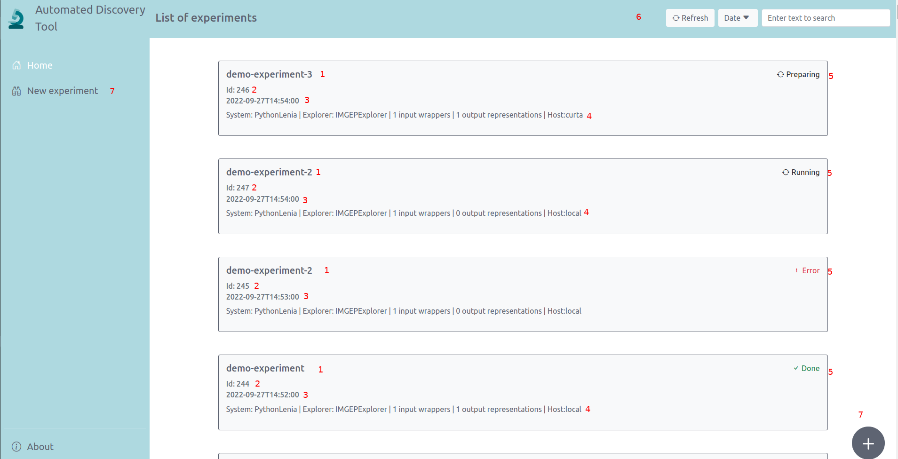
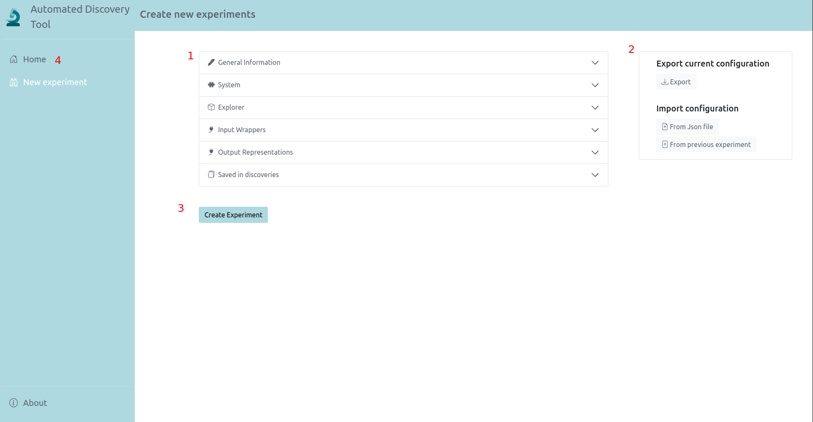
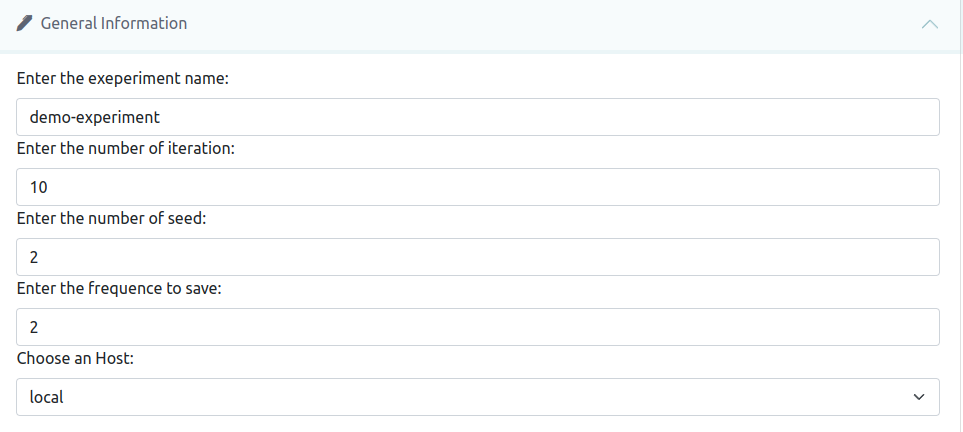
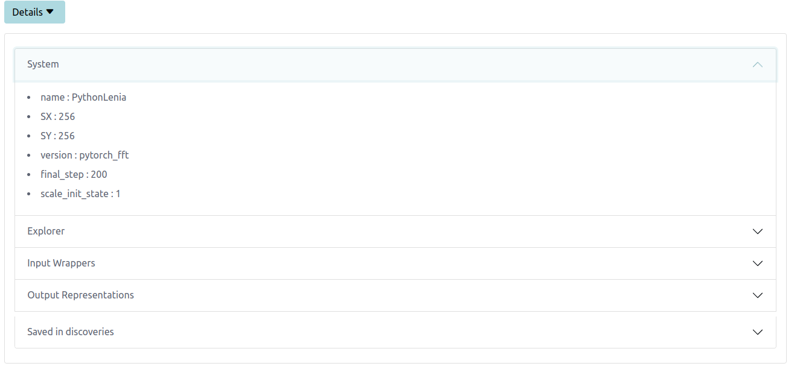
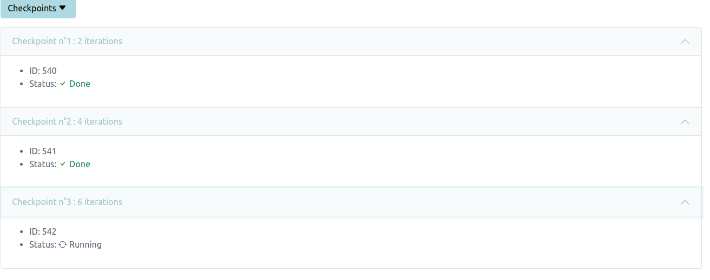
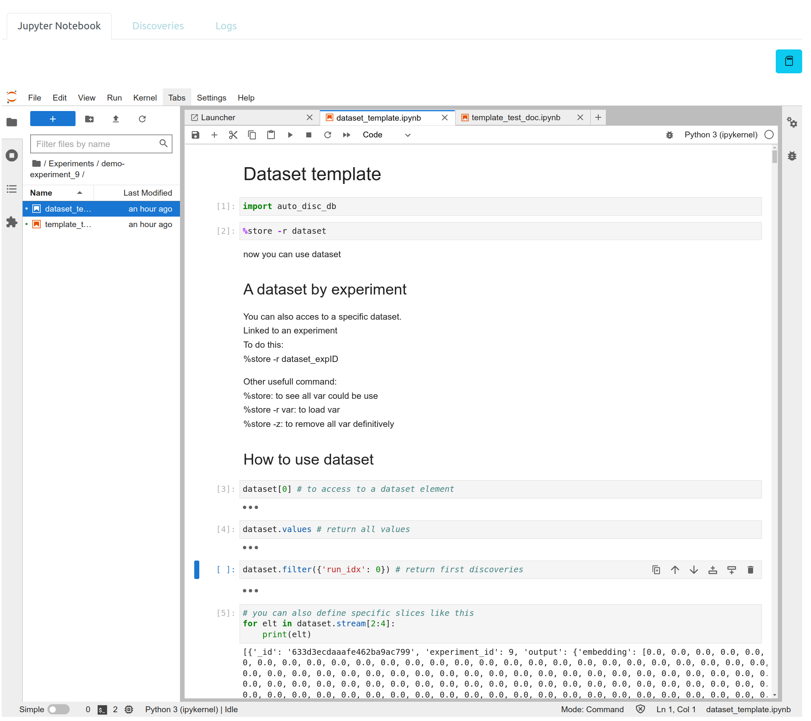
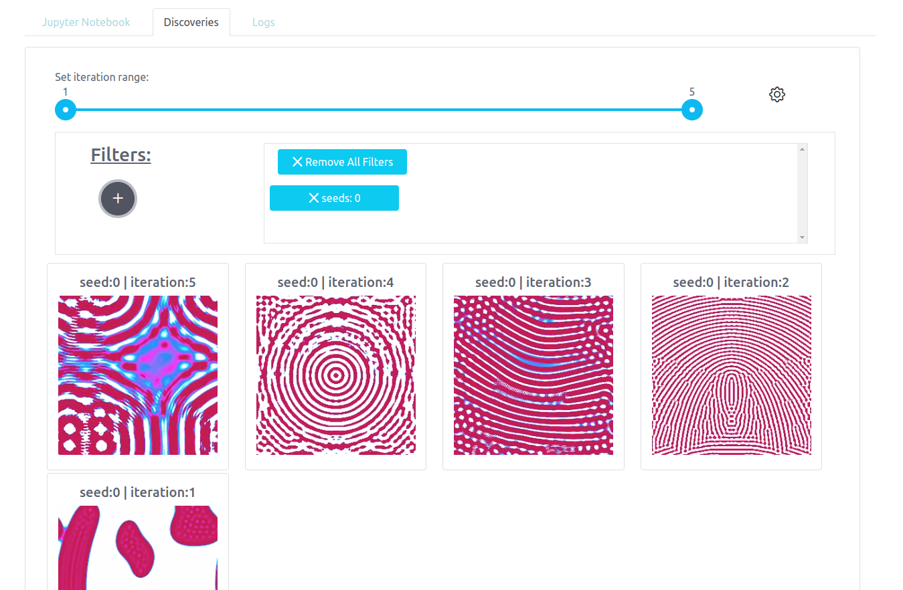
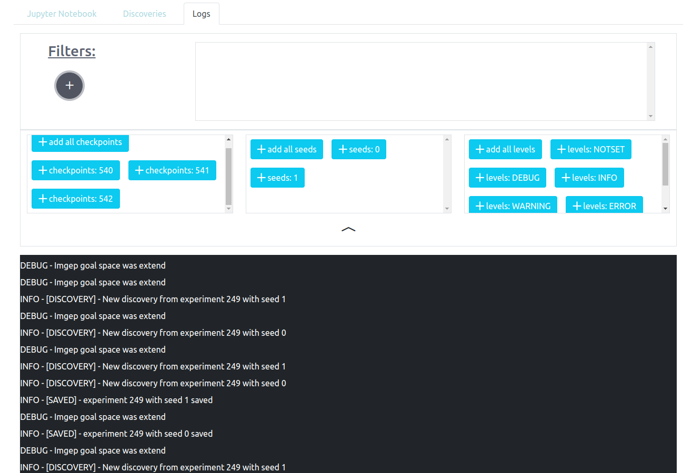

# User documentation
## Home

After starting the application and opening it in a browser at http://localhost:4200/home (localhost if you run the application localy), you will access the page presented in the picture below. 

First you can see a list of experiments and  for each experience some brief information. If you clic on an item in the list you will be redirected to the experiment monitoring page  
The numbers below correspond to those in red in the picture.
<pre>
    1: The experiment name
    2: The experiment id
    3: The date of creation
    4: All modules used in the experiment (the sytem, explorer, the number of input wrapper, the number of output representation and the host i.e.the server where you run the experiment, <i>local</i> if you run it on your pc)
    5: The current state of the experiment: <i>Done</i> if the experiment ended; <i>Preparing</i> if the experiment is in setup or if its waiting the server; <i>Running</i> if the experiment is in progress; <i>Error</i> if the experiment crashed.
    6: Some tools to manage the experiments' list: <i>Refresh</i> to synchronize the list with the database; <i>Date</i> to order by dates; A text zone to filter by the experiments or modules names.
    7: "New experiment" or the floating button redirect to the experience creation page.
</pre>
## Experiment creation

### General presentation

This page consists of 4 parts:

    1: An accordion to setup the experiment, define each modules and all parameters (we present each part later).
    2: Some tools to import and export the experiment configuration. You could export the current configuration as a JSON file and you could import a JSON file to setup the experiment. You also could re load a past experiment to set the current experiment.
    3: After having setup the experiment you could launch it with the "Create experiment" button.
    4: "Home" to be redirected to the homepage.

Now we will see each part of the accordion.

General information:

    1: The name of the experiment. Must contain only alpha numeric characters, "-" and "_".
    2: The number of iterations. How many generations of the system will be explored.
    3: The number of seeds. How many different seeds will be used.
    4: The saving frequency. Every n generations a checkpoint will be created
    5: The host. The computer on which the experiment will be run. Local if it is on your pc; the name of the server otherwise.

## Monitoring experiment

The monitoring experiment page give you access to the tools to manage the experiment. You can visualize discoveries and logs generated by the experiment. You have acces to some information about the experiment config. More important you have acces to a jupyter lab link to the experiment to manipulate all things generated by the experiment.

  
The *Details* part displays information about the experiment config. You have access to all modules used in the experiment, the current system, the current explorer, the list of input wrappers and output representations and the config for each of them and you can see all items the experiment has saved.

  
The *checkpoints* part displays every checkpoint id with its status (Done, running, error...) and the experiment iteration number when the checkpoint was created.

  
The *jupyter* part gives you access to tools to monitor many things. In it you have acces to the database and every results produced by an experiment.
The "dataset_template" notebook show you how to acces the database and demonstrate a simple way to manipulate data.
The yellow/blue popover informs weither the jupyter kernel is available and connected to the database or not.

  
The *discoveries* part displays all discoveries made by the experiment. You can filter them by seed, by iteration range and the number of discoveries per page at will.

  

Finally you have a *logs* part where you can read all logs made by the experiment and filter them by checkpoints, seeds or log levels.

  
