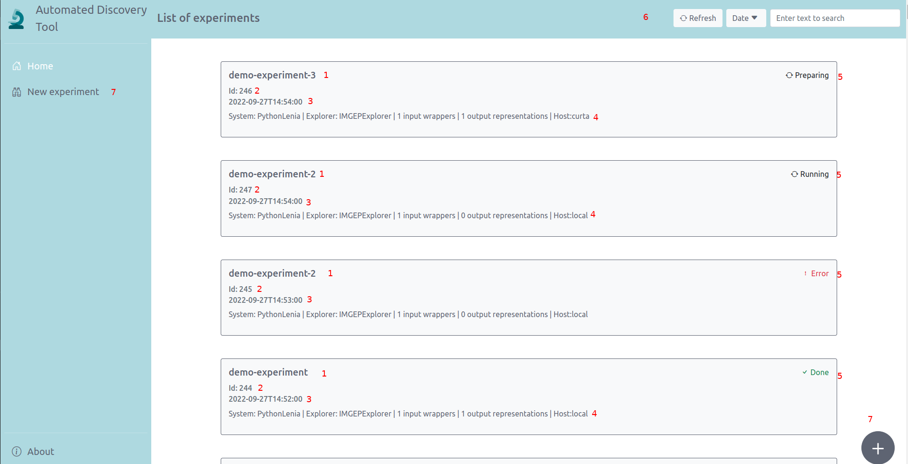
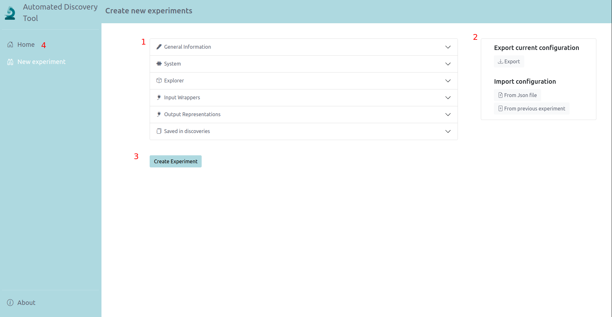
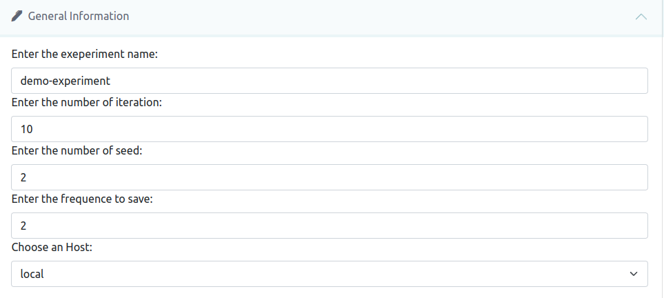

# User documentation
## Home

after starting the application and opening it in a browser at http://localhost:4200/home (localhost if you run the application localy). You will access the page presented in the photo below. 

First you can see a list of experiments and  for each experience some brief information. If you clic on an item in the list you will be redirected to the experiment monitoring page  
The numbers below correspond to those in red in the image.

    1: The experiment name
    2: The experiment id
    3: The date of creation
    4: All modules used in the experiment (the sytem, explorer, the number of input wrapper, the number of output representation and the host the server where you run the experiment local if you run it on your pc)
    5: The current state of the experiment. Could be Done if the experiment have finished, preparing if the experiment are in setup or if we waiting the server, running if the experiment is in progress or error if the experiment crashed.
    6: Some tools to manege the experiments list. refresh to synchronize the list with the database. Date to order by date. A text zone to filter by the experiment name or modules names.
    7: "New experiment" or the floating button redirect to the experience creation page.

## Experiment creation

### Genetal presentation

This page consits of 4 parts:

    1: An accordion to setup the experiment define each modules and all parameters (we present each part later).
    2: Some tools to import and export the experiment configuration. You could export the current configarution as a JSON file and you could import a JSON file to setup the experiment you also could re load a past experiment to set the current experiment.
    3: After having setup the experiment you could launch it with the "Create experiment" button.
    4: "Home" to be redirected to the homepage.

Now we will see each part of the accordion.

General information:

    1: The name of the experiment. Must contain only alpha numeric character only alpha numeric characters and "-" and "_".
    2: The number of iterations. how many generations of the system will be explored.
    3: number of seed. How many different seed will be use.
    4: The frequence to save. Every how many generations a checkpoint will be created
    5: The host. The computer on which the experiment will be run. Local if it is on your pc the name of the server otherwise.

## Monitoring experiment